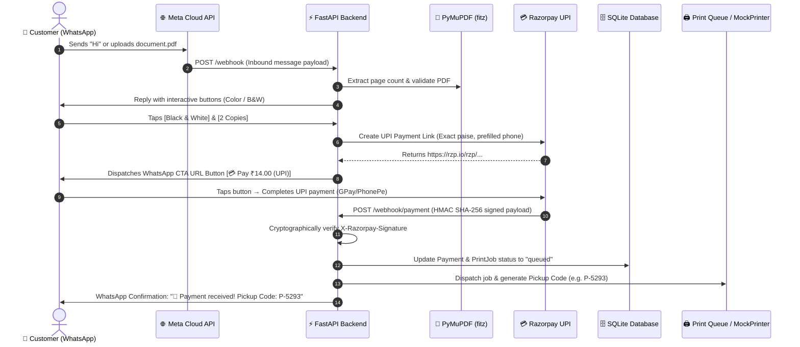

# 🖨️ WhatsApp Print Agent

[](https://www.python.org/)
[](https://fastapi.tiangolo.com)
[](https://developers.facebook.com/docs/whatsapp/cloud-api)
[](https://razorpay.com/)
[](https://langchain-ai.github.io/langgraph/)
[]()
[](LICENSE)

An automated, self-service WhatsApp printing platform designed for Xerox shops, cyber cafes, university campuses, and co-working spaces. Customers upload documents via WhatsApp, configure print options with zero-typing interactive buttons, pay instantly via **Google Pay / PhonePe / Paytm (UPI)**, and receive a secure pickup code.

---

## 🚀 The Problem & Solution

```
┌─────────────────────────────────────────────────────────────┐
│ ❌ THE OLD WAY (Manual & Chaotic)                           │
│ 10+ customers queue up → Send PDFs to personal numbers     │
│ → Pen drives with virus risks → Manual page counting       │
│ → Verify fake payment screenshots → 5-10 mins per customer │
└─────────────────────────────────────────────────────────────┘
                              ▼
┌─────────────────────────────────────────────────────────────┐
│ ✅ THE WHATSAPP PRINT AGENT WAY                             │
│ Scan Counter QR → Upload PDF to WhatsApp → Tap Buttons      │
│ → Native UPI Modal (GPay/PhonePe) → Instant Verified Webhook│
│ → 4-Digit Pickup Code (P-5293) → Prints in < 30 seconds!    │
└─────────────────────────────────────────────────────────────┘
```

---

## ✨ Key Features

- **📱 Zero-Typing Interactive WhatsApp Flow**: Native interactive button menus (`1 Copy`, `2 Copies`, `Color`, `B&W`) and Call-to-Action URL buttons (`[💳 Pay ₹14.00 (UPI)]`).
- **💳 Real UPI Payment Gateway**: Direct Razorpay integration prefilling the customer's phone number and restricting payment options strictly to UPI apps.
- **🔐 Cryptographically Verified Webhooks**: All incoming payment notifications are cryptographically verified using HMAC SHA-256 signatures before touching the database or print queue.
- **🛡️ Strict Deterministic Architecture**: Adheres strictly to [`AGENTS.md`](./AGENTS.md) principles. AI is completely isolated from business operations:
  - **Pricing calculations**: Handled 100% deterministically in Python (`PricingService`).
  - **Payments & Verification**: Gated strictly inside `PaymentGateway` and `PaymentService`.
  - **File Validation & Page Count**: Handled directly via PyMuPDF (`fitz`).
- **💰 State-Based Token & Cost Optimization**: Zero LLM/AI tokens are consumed during active transactional states (`select_color`, `select_copies`, `payment_pending`) or standard greetings (`hi`, `hello`, `menu`).
- **🔁 In-Memory Webhook Deduplication**: LRU deduplication cache eliminates redundant responses from Meta webhook delivery retries.
- **🧪 100% Automated Test Suite**: 35 comprehensive unit tests, integration tests, and agent evaluation suites.

---

## 🏗️ Architecture & Workflow



---

## 📁 Repository Structure

```text
whatsapp-print-agent/
├── AGENTS.md                  # Core deterministic boundaries & safety rules
├── SPEC.md                    # 12-step product specification
├── ARCHITECTURE.md            # Architectural design & service boundaries
├── API_CONTRACT.md            # HTTP endpoint specifications & payloads
├── CODING_RULES.md            # Python & FastAPI standards
├── TESTING.md                 # Test suite documentation & execution commands
├── EVALS.md                   # Agent evaluation criteria & safety guardrails
├── docs/                      # Domain specifications (WhatsApp, Printing, Payments)
├── knowledge/                 # Pricing tables, paper formats, and FAQ
├── app/
│   ├── main.py                # FastAPI entrypoint & lifespan events
│   ├── config.py              # Pydantic configuration settings
│   ├── api/
│   │   ├── whatsapp.py        # Meta WhatsApp webhook (GET verify, POST receive)
│   │   ├── payment.py         # Razorpay cryptographic webhook handler
│   │   └── simulator.py       # Local testing simulator
│   ├── services/
│   │   ├── conversation.py    # Multi-step session state machine
│   │   ├── document.py        # PyMuPDF page counting & storage
│   │   ├── pricing.py         # Deterministic price calculation
│   │   ├── payment.py         # Payment record management
│   │   ├── payment_gateway.py # Razorpay UPI links & HMAC verification
│   │   ├── printing.py        # MockPrinter & print job dispatching
│   │   └── whatsapp.py        # Meta Cloud API outbound dispatcher
│   ├── agent/                 # LangGraph natural language fallback agent
│   ├── models/                # SQLAlchemy database models
│   └── schemas/               # Pydantic request/response validation
├── tests/
│   ├── unit/                  # Unit tests (pricing, document, payment, printer)
│   ├── integration/           # Integration tests (WhatsApp & Razorpay webhooks)
│   └── evals/                 # Agent intent & option extraction evaluations
├── run_server.sh              # Production daemon launcher (Uvicorn + Tunnel)
├── requirements.txt           # Pinned dependencies
└── .env.example               # Environment variables template
```

---

## ⚙️ Quickstart Guide

### 1. Prerequisites
- Python 3.10 or higher
- Meta WhatsApp Business Account with Cloud API access
- Razorpay Account (Test or Live Mode)

### 2. Installation
Clone the repository and set up a virtual environment:
```bash
git clone https://github.com/amitsingh17051/whatsapp-print-agent.git
cd whatsapp-print-agent

python3 -m venv .venv
source .venv/bin/activate
pip install -r requirements.txt
```

### 3. Configure Environment Variables
Copy `.env.example` to `.env`:
```bash
cp .env.example .env
```
Fill in your credentials:
```ini
# WhatsApp Cloud API Credentials
WHATSAPP_VERIFY_TOKEN=your_verify_token_123
WHATSAPP_API_TOKEN=your_meta_access_token
WHATSAPP_PHONE_NUMBER_ID=your_phone_number_id
WHATSAPP_GRAPH_API_URL=https://graph.facebook.com/v19.0

# Set to false to send real WhatsApp messages to phone
MOCK_MODE=false

# Application Settings
DATABASE_URL=sqlite:///./print_agent.db
STORAGE_DIR=./storage/uploads
OUTPUT_DIR=./output

# Pricing Rates (INR)
BW_RATE_PER_PAGE=2.0
COLOR_RATE_PER_PAGE=10.0

# Razorpay Credentials
RAZORPAY_KEY_ID=rzp_test_xxxxxx
RAZORPAY_KEY_SECRET=your_razorpay_secret
RAZORPAY_WEBHOOK_SECRET=your_webhook_secret
```

### 4. Start the Application
Run the automated server script:
```bash
chmod +x run_server.sh
./run_server.sh
```
Or start Uvicorn directly:
```bash
.venv/bin/uvicorn app.main:app --host 127.0.0.1 --port 8000 --reload
```

---

## 🌐 Webhook Configuration

### 1. Meta WhatsApp Cloud API
1. In Meta Developer Portal $\rightarrow$ **WhatsApp** $\rightarrow$ **Configuration**.
2. Set **Callback URL**: `https://<your-domain>/webhook`
3. Set **Verify Token**: `your_verify_token_123`
4. Subscribe to the **`messages`** webhook field.

### 2. Razorpay Dashboard
1. In Razorpay Dashboard $\rightarrow$ **Settings** $\rightarrow$ **Webhooks**.
2. Set **Webhook URL**: `https://<your-domain>/webhook/payment`
3. Set **Secret**: Matches `RAZORPAY_WEBHOOK_SECRET` in your `.env`.
4. Subscribe to active events:
   - `payment_link.paid`
   - `payment.captured`

---

## 🧪 Testing & Quality Assurance

Run the automated test suite:
```bash
# Run all 35 tests
.venv/bin/pytest -v

# Run linter
.venv/bin/ruff check .
```

### Test Coverage Highlights:
- **Unit Tests**: PyMuPDF page parsing, pricing math, MockPrinter dispatching, and Razorpay HMAC signature validation (tampered payloads, invalid secrets, etc.).
- **Integration Tests**: Meta webhook challenge verification, end-to-end 12-step WhatsApp flow, interactive button workflows, and Razorpay payment webhook fulfillment.
- **Agent Evaluations**: Strict validation that the AI agent never handles pricing math, database writes, or printer commands.

---

## 💼 Business & Monetization Models

This codebase is ready to be packaged as a commercial product for Xerox shops:

1. **SaaS Subscription**: Charge print shops ₹999 – ₹1,999/month per printer with zero commission.
2. **Per-Print Convenience Fee**: Offer the software free to shops and charge ₹0.20 per printed page (generates ~₹6,000/month per shop at 1,000 copies/day).
3. **Turnkey Campus Kiosks**: Place automated printers in university libraries, coaching hubs, and hostels with self-service UPI printing.

---

## 📄 License
This project is licensed under the [MIT License](LICENSE).

